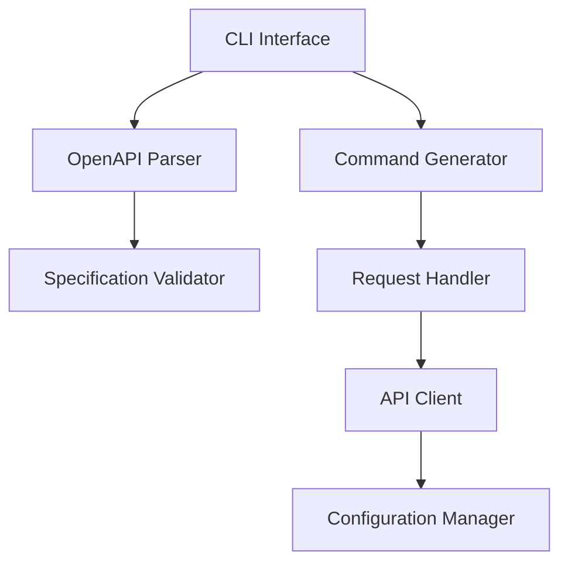

# Software Architecture

## Overview

The OpenAPI CLI Generator follows a modular architecture designed to fulfill the [requirements](Requirements.md) and support the defined [use cases](UseCases.md). The system is built using Python and follows clean architecture principles with clear separation of concerns.

## Architecture Layers

### 1. Presentation Layer
**Purpose**: Handle user interactions and command-line interface
**Components**:
- CLI Interface (implements [FR2.1](Requirements.md#fr2-cli-generation))
- Command Parser
- Help Generator (implements [FR2.3](Requirements.md#fr2-cli-generation))
- Output Formatter

**Key Classes**:
- `CLIGenerator`: Main class for generating CLI commands
- `CommandParser`: Handles command-line argument parsing
- `HelpFormatter`: Formats help documentation

### 2. Business Logic Layer
**Purpose**: Core functionality and business rules
**Components**:
- OpenAPI Parser (implements [FR1.1](Requirements.md#fr1-openapi-specification-parsing))
- Command Generator
- Request Handler (implements [FR4.1](Requirements.md#fr4-request-handling))
- Response Processor

**Key Classes**:
- `OpenAPIParser`: Parses and validates OpenAPI specifications
- `RequestHandler`: Manages API requests and responses
- `ParameterValidator`: Validates input parameters

### 3. Data Layer
**Purpose**: Handle data persistence and API interactions
**Components**:
- Configuration Manager (implements [FR3.1](Requirements.md#fr3-api-management))
- API Client
- Cache Manager
- Storage Handler

**Key Classes**:
- `Config`: Manages API configurations and settings
- `APIClient`: Handles API communications
- `StorageManager`: Manages persistent storage

## Component Interactions

## Key Design Patterns

1. **Command Pattern**
   - Used in CLI command generation
   - Supports [UC2.1](UseCases.md#uc21-execute-api-command)
   - Implements [FR2.2](Requirements.md#fr2-cli-generation)

2. **Factory Pattern**
   - Used in request/response handling
   - Supports [UC4.1](UseCases.md#uc41-data-creation)
   - Implements [FR4.2](Requirements.md#fr4-request-handling)

3. **Singleton Pattern**
   - Used in configuration management
   - Supports [UC1.1](UseCases.md#uc11-add-new-api)
   - Implements [FR3.1](Requirements.md#fr3-api-management)

4. **Strategy Pattern**
   - Used in API client implementations
   - Supports [UC2.1](UseCases.md#uc21-execute-api-command)
   - Implements [FR4.1](Requirements.md#fr4-request-handling)

## Security Considerations

1. **Authentication**
   - Secure credential storage ([NFR4.1](Requirements.md#nfr4-security))
   - API key management ([NFR4.3](Requirements.md#nfr4-security))
   - HTTPS support ([NFR4.2](Requirements.md#nfr4-security))

2. **Data Protection**
   - Input sanitization ([NFR4.4](Requirements.md#nfr4-security))
   - Secure configuration storage
   - Parameter validation

## Performance Optimizations

1. **Command Execution**
   - Command caching
   - Lazy loading of specifications
   - Implements [NFR1.1](Requirements.md#nfr1-performance)

2. **Resource Management**
   - Memory usage optimization
   - Connection pooling
   - Implements [NFR1.3](Requirements.md#nfr1-performance)

## Error Handling

1. **User Errors**
   - Input validation ([NFR2.2](Requirements.md#nfr2-reliability))
   - Clear error messages ([NFR3.2](Requirements.md#nfr3-usability))
   - Usage guidance

2. **System Errors**
   - Connection timeout handling ([NFR2.3](Requirements.md#nfr2-reliability))
   - Graceful degradation
   - Error logging

## Testing Strategy

1. **Unit Testing**
   - Component-level tests
   - Mock integrations
   - Implements [NFR5.3](Requirements.md#nfr5-maintainability)

2. **Integration Testing**
   - API interaction tests
   - Command execution tests
   - Configuration management tests

## Future Considerations

1. **Extensibility**
   - Plugin system for custom commands
   - Additional authentication methods
   - Custom output formatters

2. **Scalability**
   - Support for multiple concurrent users
   - Distributed configuration management
   - API request rate limiting
